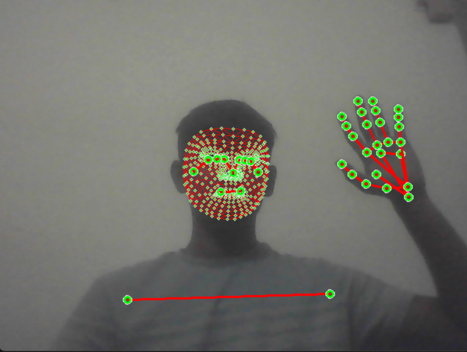

# Driver Monitoring System

This project uses MediaPipe to detect hand and face landmarks and alert the driver if they are using their mobile phone while driving.

## Setup

### 1. Create a Virtual Environment

Open a terminal and run the following command to create a virtual environment:

- `python -m venv venv`

### 2. Activate the Virtual Environment

Activate the virtual environment:

- `venv\Scripts\activate` (on Windows)
- `source venv/bin/activate` (on macOS/Linux)

### 3. Install Required Libraries

Install the required libraries by running:

- `pip install -r requirements.txt`

### 4. Run the Application

Run the main application file:

- `python main.py`

This will open your camera and detect if you are talking on phone or not. It will also play an alert sound if it detects that you are using phone.

### 5. Quit the Application

To quit the application, press the 'q' key on your keyboard.

Note: Make sure you have a webcam connected to your computer for the application to work properly.